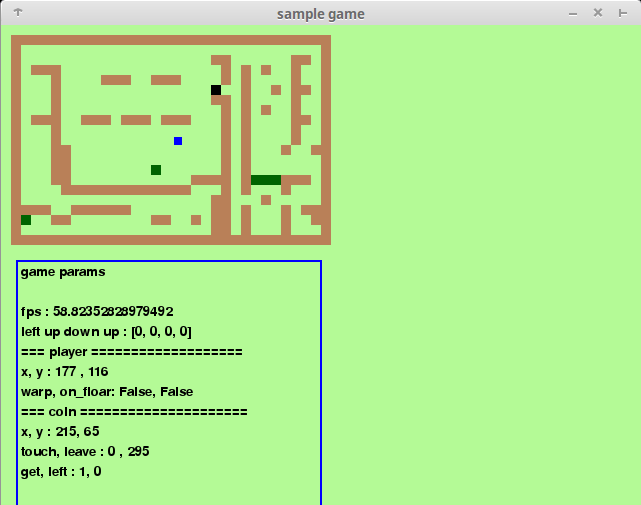

# coin gather game


the game, which player gathers coins


# how to play :: install and execute

## player_mode
requipments : pygame  # sdl game_engine wrapper for python
```
$ pip install pygame 
$ python game.py
```


## AI_mode
requipments : chainer # and some dependments
```
$ pip install chainer # and some dependments
$ python neuralnet_ai.py 
```
### neuralnet_ai.py
example of `ai_lib`   
using 4-layer neural network, the sample model to gain actions.  
more detils : [documents/neuralnet_ai](documents/neuralnet_ai.md) (Japanese)  

# rule
touching this to understand this game.

## objects of environment

| name | shape | works |
|--|--|--|
| player | blue rect | player |
| wall | broun rect | make player reflected |
| warmhole | green rect | make player worped |
| coin | black->pink (rect) | object to gather |

## operation
1.using `arrow keys`, move to where coins were placed.
1.while player touches coin, the color of coins are changed
1.after touch them for awhile, coin appears next place.
1.repeat it
1.`z` key to give up currently appeared coin
1.`Esc` to exit game


## operation (AI_mode)
more detils : [documents/neuralnet_ai](documents/neuralnet_ai.md) (Japanese)  
for `neuralnet_ai.py`, in addition to player_mode ...

### keys list

| key | works |
|--|--|
| x | teach use arrow key |
| c | out of stack to network |
| | |
| a | down fps rate |
| q | up fps rate |
| | |
| w | up frame_per_predict |
| s | down frame_per_predict |
| | |
| r | save network model |
| f | load_network model |
| | |
| d | exit game |


# hacking
more detils : [documents/hacking](documents/hacking.md) (Japanese)__

# to do
i want to do these things
1. implement space division search to make it faster to collision detection
1. make faster list_tree_to_list  # because of recursion
1. implement AI player
1. player who has neural net
1. more useful UI
